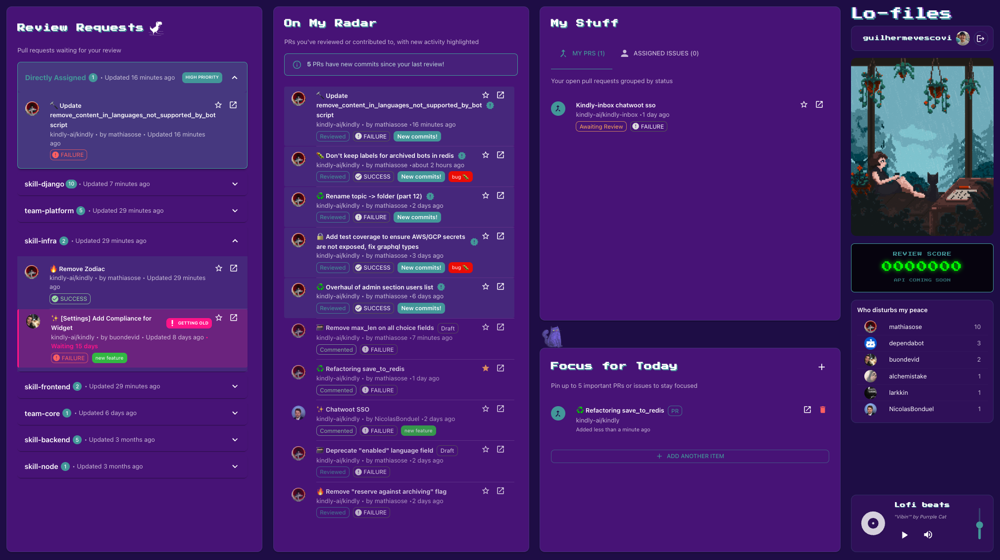

# lofiles-dashboard

A single-pane-of-glass dashboard that cuts through the noise of GitHub notifications. It tells you exactly what needs your attention *right now*, what you're waiting on, and what you've recently been involved in, so you can start your day focused and productive.



*Complete dashboard view with lofi vibe, GitHub widgets, and focus management*

## 🎯 Core Principles

1. **Action-Oriented:** The primary goal is to surface items that require an action from *you*.
2. **Signal over Noise:** Aggregate information from across all your repositories, but present it in a prioritized, de-duplicated way.
3. **Reduce Mental Overhead:** No more manually checking 10 different PRs to see their status. The dashboard does it for you.
4. **Personalized Context:** The dashboard is *your* view, reflecting your direct work and recent interactions.

## ✨ Features

### 📥 Triage Widget: What Needs My Immediate Attention?
- **Smart Review Assignment Grouping:** PRs organized by how they're assigned to you:
  - **🎯 Directly Assigned** - PRs specifically assigned to you (highlighted with high priority styling)
  - **👥 Team Assignments** - PRs assigned to your skill groups (e.g., skill-backend, skill-frontend)
- **Priority-Based Sorting:** Direct assignments appear first, then sorted by most recent activity
- Shows CI/CD status (passing checks, failing builds)
- Displays PR title, repository, author, and last updated time

### 🚀 In-Flight Widget: My Active Workstream
- **My Open Pull Requests:** All PRs you have authored, grouped by status:
  - `Draft`, `Awaiting Review`, `In Review`, `Approved`

### 👀 On My Radar Widget: Keeping Context *(Key Feature!)*
- **PRs I've Reviewed:** Lists PRs you have already approved or commented on
- **🔥 Highlights new commits since your last review** - this is a major pain point solver!
- **PRs I've Contributed To:** Shows PRs you've pushed commits to (collaborative work)
- **Threads I'm In:** PRs/Issues where you've participated in discussions

### 🎯 Focus for Today Widget
- Manually pin 1-5 important issues or PRs for your daily focus
- Stored in browser localStorage - your personal to-do list
- Add items via GitHub URL with auto-parsing

## 🚀 Quick Start

### Prerequisites
- Node.js 16+ and npm
- A GitHub account

### Setup

1. **Clone and install:**
   ```bash
   git clone <repository-url>
   cd lofiles-dashboard
   npm install
   ```

2. **For the demo version (easiest):**
   ```bash
   npm start
   ```
   - The app will prompt for a GitHub Personal Access Token
   - Go to [GitHub Settings > Personal access tokens](https://github.com/settings/tokens)
   - Generate a token with the following scopes:
     - `repo` - Access to repositories
     - `read:user` - Read user profile information
     - `read:org` - Read organization and team information (required for team review assignments)
     - `read:discussion` - Read discussions (required for advanced team features)
   - Paste it when prompted in the app

3. **For automatic authentication (recommended):**
   - Create `.env` file: `cp .env.example .env`
   - Add your GitHub Personal Access Token to `.env`:
     ```bash
     REACT_APP_GITHUB_TOKEN=your_github_personal_access_token_here
     ```
   - Run `npm start` - the app will automatically authenticate using your token
   - No more manual token entry prompts!

4. **For full OAuth setup (production):**
   - Go to [GitHub Settings > OAuth Apps](https://github.com/settings/applications/new)
   - Set **Authorization callback URL** to: `http://localhost:3000/callback`
   - Copy the Client ID
   - Add to your `.env` file:
     ```bash
     REACT_APP_GITHUB_CLIENT_ID=your_github_client_id_here
     REACT_APP_REDIRECT_URI=http://localhost:3000/callback
     ```

## 🐳 Docker Setup

### Quick Start with Docker

1. **Build and run with Docker Compose:**
   ```bash
   docker compose up -d
   ```
   - App will be available at `http://localhost:3003`

2. **Custom port:**
   ```bash
   APP_PORT=4000 docker compose up -d
   ```
   - App will be available at `http://localhost:4000`

3. **With automatic authentication (recommended):**
   ```bash
   # Create .env file with your GitHub Personal Access Token
   echo "REACT_APP_GITHUB_TOKEN=your_github_token_here" > .env
   
   # Build and run (token will be embedded in the build)
   docker compose up -d
   ```
   - The app will automatically authenticate using your token
   - No manual token entry required after logout/login

### Docker Commands

```bash
# Build the image
docker compose build

# Run in background
docker compose up -d

# View logs
docker compose logs -f

# Stop the container
docker compose down

# Rebuild after code changes
docker compose up -d --build
```

### Docker Architecture

- **Multi-stage build:** Node.js for building, Nginx for serving
- **Production optimized:** Static files served by Nginx with gzip compression
- **SPA routing:** Nginx configured for React Router support
- **Environment variables:** Build-time configuration for GitHub OAuth

## 🏗️ Technical Architecture

### Frontend Stack
- **React 18** with **TypeScript** - Modern, type-safe development
- **Material-UI (MUI)** - Professional, accessible component library
- **Apollo Client** - Efficient GraphQL state management with caching
- **date-fns** - Lightweight date formatting

### GitHub Integration
- **GitHub GraphQL API v4** - Single, efficient API calls instead of dozens of REST requests
- **Comprehensive Data Fetching** - All dashboard data in one GraphQL query


## 🛠️ Available Scripts

```bash
# Start development server
npm start

# Run tests
npm test

# Build for production
npm run build

# Type checking
npx tsc --noEmit
```

## 🔧 Troubleshooting

### Authentication Issues

**Problem**: App prompts for manual token entry even with `.env` file
**Solution**: 
- Ensure your `.env` file uses `REACT_APP_GITHUB_TOKEN` (not `REACT_APP_GITHUB_CLIENT_ID`)
- For Docker: Rebuild the container after changing `.env`: `docker compose up -d --build`
- For development: Restart the dev server after changing `.env`

**Problem**: Logout/login still prompts for token
**Solution**: 
- Check that `REACT_APP_GITHUB_TOKEN` is correctly set in your `.env` file
- The token should be a GitHub Personal Access Token, not an OAuth Client ID

### Token Scopes
Make sure your GitHub Personal Access Token has these scopes:
- `repo` - Access to repositories
- `read:user` - Read user profile information  
- `read:org` - Read organization and team information
- `read:discussion` - Read discussions


## ⚠️ Security warning about token storage

- **Where the token is stored**: When you provide a token, this app stores it in the browser under this origin using `localStorage` keys `github_token` and `github_user` (see `src/context/AuthContext.tsx`).
- **Isolation**: Browser storage is scoped per origin and per browser profile. Other users on other devices/browsers/profiles cannot access your token. Private/incognito windows have separate storage.
- **Risk (XSS)**: Any JavaScript that runs on this page can read `localStorage`. Avoid injecting untrusted content and keep dependencies up-to-date. Consider a strict Content Security Policy (CSP) for hardened deployments.
- **Persistence**: Tokens in `localStorage` persist across restarts. If you prefer non-persistent sessions, change the implementation to use `sessionStorage` instead.


