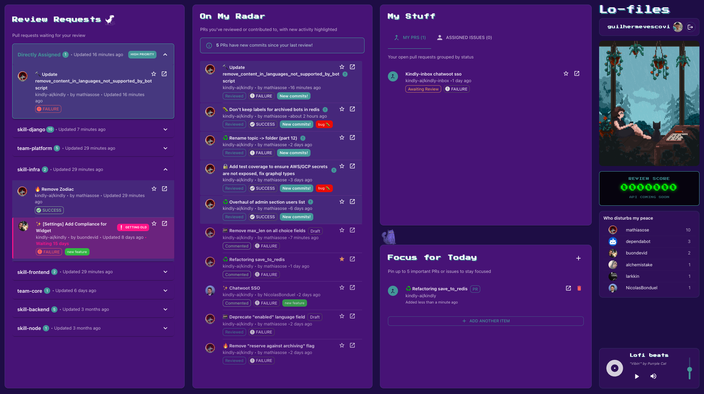

# lofiles-dashboard

A single-pane-of-glass dashboard that cuts through the noise of GitHub notifications. It tells you exactly what needs your attention *right now*, what you're waiting on, and what you've recently been involved in, so you can start your day focused and productive.



*Complete dashboard view with lofi vibe, GitHub widgets, and focus management*

## 🎯 Core Principles

1. **Action-Oriented:** The primary goal is to surface items that require an action from *you*.
2. **Signal over Noise:** Aggregate information from across all your repositories, but present it in a prioritized, de-duplicated way.
3. **Reduce Mental Overhead:** No more manually checking 10 different PRs to see their status. The dashboard does it for you.
4. **Personalized Context:** The dashboard is *your* view, reflecting your direct work and recent interactions.

## ✨ Features

### 📥 Triage Widget: What Needs My Immediate Attention?
- **Smart Review Assignment Grouping:** PRs organized by how they're assigned to you:
  - **🎯 Directly Assigned** - PRs specifically assigned to you (highlighted with high priority styling)
  - **👥 Team Assignments** - PRs assigned to your skill groups (e.g., skill-backend, skill-frontend)
- **Priority-Based Sorting:** Direct assignments appear first, then sorted by most recent activity
- Shows CI/CD status (passing checks, failing builds)
- Displays PR title, repository, author, and last updated time

### 🚀 In-Flight Widget: My Active Workstream
- **My Open Pull Requests:** All PRs you have authored, grouped by status:
  - `Draft`, `Awaiting Review`, `In Review`, `Approved`

### 👀 On My Radar Widget: Keeping Context *(Key Feature!)*
- **PRs I've Reviewed:** Lists PRs you have already approved or commented on
- **🔥 Highlights new commits since your last review** - this is a major pain point solver!
- **PRs I've Contributed To:** Shows PRs you've pushed commits to (collaborative work)
- **Threads I'm In:** PRs/Issues where you've participated in discussions

### 🎯 Focus for Today Widget
- Manually pin 1-5 important issues or PRs for your daily focus
- Stored in browser localStorage - your personal to-do list
- Add items via GitHub URL with auto-parsing

## 🚀 Quick Start

### Prerequisites
- Node.js 16+ and npm
- A GitHub account

### Setup

1. **Clone and install:**
   ```bash
   git clone <repository-url>
   cd lofiles-dashboard
   npm install
   ```

2. **Create GitHub OAuth App:**
   - Go to [GitHub Settings > Developer settings > OAuth Apps](https://github.com/settings/developers)
   - Click **"New OAuth App"**
   - Fill in the details:
     - **Application name:** lofiles-dashboard (or your preferred name)
     - **Homepage URL:** `http://localhost:3001` (or your production domain)
     - **Authorization callback URL:** `http://localhost:3001/auth/callback`
   - Click **"Register application"**
   - Copy the **Client ID**
   - Generate and copy the **Client Secret**

3. **Configure environment variables:**
   ```bash
   cp .env.example .env
   ```

   Edit `.env` and set:
   ```bash
   GITHUB_CLIENT_ID=your_client_id_here
   GITHUB_CLIENT_SECRET=your_client_secret_here
   SESSION_SECRET=$(openssl rand -hex 32)
   FRONTEND_URL=http://localhost:3001
   PORT=3001
   REACT_APP_BACKEND_URL=http://localhost:3001
   ```

4. **Install and run backend:**
   ```bash
   cd server
   npm install
   npm run dev
   ```
   Backend will start on port 3001.

5. **In a new terminal, run frontend (development):**
   ```bash
   npm start
   ```
   Frontend will start on port 3000 and proxy API calls to backend on port 3001.

6. **Access the app:**
   - Open `http://localhost:3000`
   - Click **"Sign in with GitHub"**
   - Authorize the application
   - You'll be redirected back and logged in automatically

### Required GitHub OAuth Scopes

The app requests these scopes during OAuth:
- `repo` - Access to repositories
- `read:user` - Read user profile information
- `read:org` - Read organization and team information (required for team review assignments)
- `read:discussion` - Read discussions (required for advanced features)

## 🐳 Docker Setup

### Quick Start with Docker

1. **Set up environment variables:**
   ```bash
   cp .env.example .env
   ```

   Edit `.env` with your GitHub OAuth credentials and session secret:
   ```bash
   GITHUB_CLIENT_ID=your_client_id_here
   GITHUB_CLIENT_SECRET=your_client_secret_here
   SESSION_SECRET=$(openssl rand -hex 32)
   FRONTEND_URL=http://localhost:3001
   PORT=3001
   ```

2. **Build and run with Docker Compose:**
   ```bash
   docker compose up -d --build
   ```
   - App will be available at `http://localhost:3001`
   - Both frontend and backend run in a single container

3. **Custom port:**
   ```bash
   APP_PORT=4000 docker compose up -d --build
   ```
   - App will be available at `http://localhost:4000`

### Docker Commands

```bash
# Build the image
docker compose build

# Run in background
docker compose up -d

# View logs
docker compose logs -f

# Stop the container
docker compose down

# Rebuild after code changes
docker compose up -d --build
```

### Docker Architecture

- **Multi-stage build:**
  - Stage 1: Node.js builds frontend React app
  - Stage 2: Node.js builds backend Express server
  - Stage 3: Runtime with Express serving both API and static frontend
- **Production optimized:** Single Node.js server handles all requests
- **SPA routing:** Express configured to serve index.html for all routes
- **Environment variables:** Runtime configuration for GitHub OAuth and sessions

## 🏗️ Technical Architecture

### Frontend Stack
- **React 18** with **TypeScript** - Modern, type-safe development
- **Material-UI (MUI)** - Professional, accessible component library
- **Apollo Client** - Efficient GraphQL state management with caching
- **date-fns** - Lightweight date formatting

### Backend Stack (New!)
- **Express.js** - Lightweight web server for OAuth and API proxy
- **express-session** - Secure session management with encrypted cookies
- **TypeScript** - Type-safe backend development

### GitHub Integration
- **GitHub OAuth 2.0** - Industry-standard authentication flow
- **GitHub GraphQL API v4** - Single, efficient API calls instead of dozens of REST requests
- **Backend Proxy** - GraphQL requests routed through Express for secure token handling
- **Comprehensive Data Fetching** - All dashboard data in one GraphQL query


## 🛠️ Available Scripts

```bash
# Start development server
npm start

# Run tests
npm test

# Build for production
npm run build

# Type checking
npx tsc --noEmit
```

## 🔧 Troubleshooting

### Authentication Issues

**Problem**: OAuth redirect fails with "Invalid callback URL"
**Solution**:
- Verify the callback URL in your GitHub OAuth App settings matches exactly: `http://localhost:3001/auth/callback`
- For production, update to your domain: `https://yourdomain.com/auth/callback`

**Problem**: "Unauthorized" error after signing in
**Solution**:
- Check that `GITHUB_CLIENT_ID` and `GITHUB_CLIENT_SECRET` are correctly set in `.env`
- Verify the backend server is running on the expected port
- Check browser console and server logs for detailed error messages

**Problem**: CORS errors in browser console
**Solution**:
- Ensure `FRONTEND_URL` in `.env` matches the URL you're accessing the app from
- For local dev with separate frontend/backend: `FRONTEND_URL=http://localhost:3000`
- For production: `FRONTEND_URL=https://yourdomain.com`

**Problem**: Session expires immediately
**Solution**:
- Check that `SESSION_SECRET` is set to a long random string (minimum 32 characters)
- For HTTPS deployments, ensure cookies are marked as secure
- Verify your browser allows cookies

### Backend Issues

**Problem**: Backend won't start - "GITHUB_CLIENT_ID is required"
**Solution**:
- Make sure you've created a `.env` file in the root directory (not in `server/`)
- The backend reads environment variables from the root `.env` file
- Run `cp .env.example .env` and fill in your values

**Problem**: GraphQL queries fail with 401 Unauthorized
**Solution**:
- The backend proxy may not be forwarding the session correctly
- Check that `credentials: 'include'` is set in Apollo Client (already configured)
- Verify you're logged in by checking `/auth/status` endpoint


## 🔒 Security

### OAuth Implementation
- **Secure Token Storage**: Access tokens stored server-side in encrypted session cookies (httpOnly, secure, sameSite)
- **CSRF Protection**: State parameter validation in OAuth flow prevents cross-site request forgery
- **No Client-Side Tokens**: Tokens never exposed to browser JavaScript, reducing XSS attack surface
- **Session Management**: 30-day sessions with secure cookie configuration

### Best Practices for Self-Hosting
1. **Use HTTPS**: Always run behind HTTPS in production (use reverse proxy like Nginx/Caddy)
2. **Strong Session Secret**: Generate a cryptographically secure random string for `SESSION_SECRET`
   ```bash
   openssl rand -hex 32
   ```
3. **Environment Variables**: Never commit `.env` file to version control
4. **Keep Dependencies Updated**: Regularly run `npm audit` and update packages
5. **Firewall**: Restrict access to your server if only you need it


